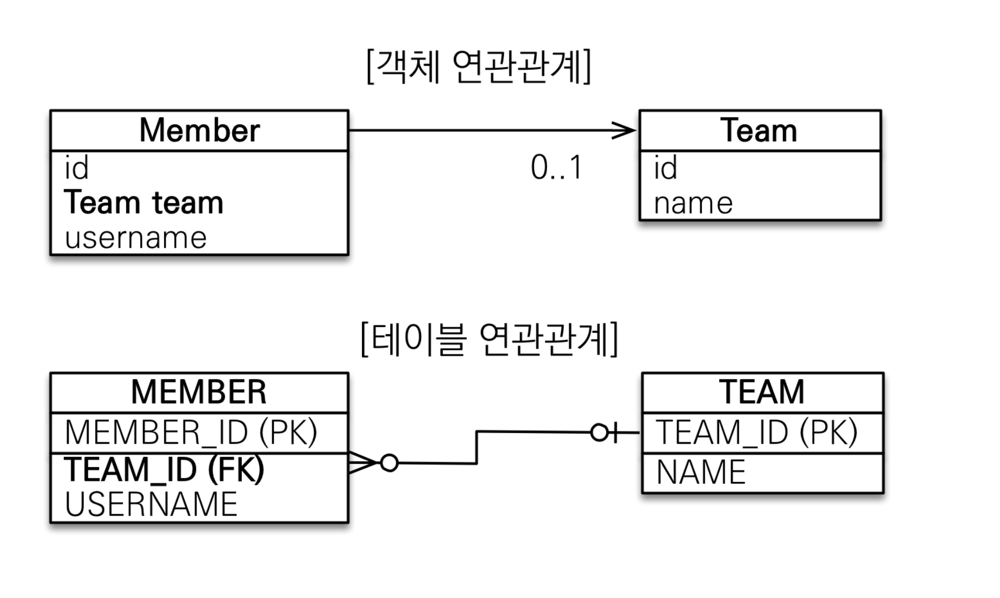
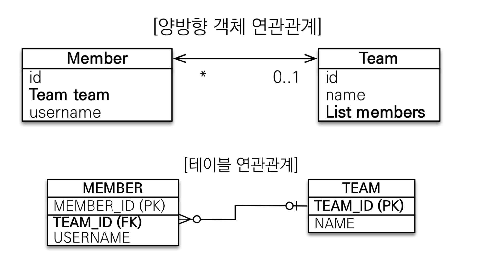

이번 강의에서는 객체와 테이블의 연관관계 차이를 이해하고, 객체의 참조와 테이블의 외래를 매핑 하는 방법의 이해를 목표로 합니다. 

> _들어가기 전에 - 용어의 이해_
>
> * 방향 : 단방향, 양방향
> * 다중성 : 일대일(1:1), 다대일(N:1), 다대다(N:N)
> * 연관 관계의 주인 

### 연관 관계가 필요한 이유
***

~~~
Member findMember = em.find(Member.class, member.getId());

Long find TeamId = findMember.getId();
Team findTeam = em.find(Team.class, findTeamId);
~~~

위의 예시는 회원과 팀이라는 테이블이 존재할 때, 보통 사용되는 코드 입니다. 
연관 관계가 정해져 있지 않아 member의 Team을 찾기 위해서 DB에서 계속 꺼내와야 합니다.

이렇게 코딩이 진행 되는 이유는 :
* 테이블은 외래키키로 조인을 사용해서 연관된 테이블을 찾습니다.
* 객체는 참조를 사용해서 연관된 객체를 찾습니다. 

:boom: 테이블과 객체 사이에는 이런 큰 간격이 있습니다. 
이로 인해, **많은 비용이 발생하게 되고 코드는 객체 지향 스럽지 않게** 됩니다.

__이와 같이 객체를 테이블에 맞추어 데이터 중심으로 모델링 하면, 협력 관계를 만들 수 없습니다.__

이런 문제를 해결하기 위해 연관관계 매핑을 사용합니다. 

### 단방향 연관관계
*** 

객체와 테이블의 차이점이 보이시나요?

* 객체 연관 관계

회원 객체는 변수(team)로 팀 객체와 연관 관계를 맺습니다. 
이는 **단방향 관계**입니다. 회원은 변수 team 을 통해 팀을 알 수 있지만, 팀은 멤버 변수가 없어 조회가 불가능 하기 떄문입니다. 

* 테이블 연관관계

회원 테이블은 외래 키(TEAM_ID)를 사용해서 연관 관계를 맺습니다. 이는 **양방향 관계**입니다. JOIN을 사용하면 위의 두 테이블은 서로를 조회 할 수 있습니다. 

#### _객체와 테이블은 위와 같 차이점이 있습니다. 다시 한번 정리하자면:_
:mag: 객체는 참조(주소)로 연관관계를 맺습니다. → 단방향

:mag: 테이블은 왜래 키로 연관관계를 맺습니다. → 양방향

:exclamation: 그렇다면 이제, 이를 배경으로 연관 관계를 매핑해 보겠습니다. 
1. 두 객체의 방향을 고려합니다. 
2. 두 객체의 다중성을 결정합니다. 
3. 연관 관계의 주인을 설장합니다. 

eg)
~~~
@Entity
public class Member {

    ...
    
    @ManyToOne
    @JoinColumn(name = "TEAM_ID")
    private Team team;
}
~~~

이렇게 매핑을 끝낸 후, 다시 Team을 찾아 보겠습니다. 
~~~
Member findMember = em.find(Member.class, member.getId());

Team findTeam = findMember.getTeam();
~~~
훨씬 객체지향 스러워졌습니다. 이렇게 참조를 통해 연관관계를 조회하는 것을 **객체 그래프 탐색** 이라고 합니다. 

### @ManyToOne
다대일(N:1)을 뜻합니다.

:pushpin:속성
* optional (true) : false로 설정시 연관된 엔티티가 항상 있어야 합니다. 
* fetch (FetchType.EAGER) : 글로벌 패치 전략을 설정합니다. 
* cascade : 영속성 전이기능을 사용합니다. 
* targetEntity : 연관된 엔티티의 타입 정보를 설정합니다. 

### @JoinColumn
외래키를 매핑할 때 사용합니다. 

:pushpin:속성
* name : 매핑할 왜리키 이름을 적습니다. 
* referencedColumn : 외래 키가 참조하는 대상 테이블의 컬럼명을 적습니다. 
* foreignKey (DDL) : 외래 키 제약조건을 직접 지정할 수 있습니다. 테이블을 사용할 떄만 생성합니다. 
* unique, nullable, insertable, updatable, columnDefinition, table : @Column의 속성과 같습니다. 

## 양방향 연관관계와 연관관계의 주인
*** 

위 이미지를 보면 회원에서 팀은 N에서 1의 방향으로 바라봅니다. 팀에서 회원은 1 에서 N을 향합니다.
1:N 관계는 여러 값을 가질 수 있기 때문에 컬렉션을 사용합니다. 

~~~
@Entity
public class Member {

    ...
    
    @ManyToOne
    @JoinColumn(name = "TEAM_ID")
    private Team team;
}
~~~

~~~
@Entity
public class Team {

    ...
    
    @OneToMany(mappedBy = "team")
    private List<Member> members = new ArrayList<Member>();
}
~~~
이를 반양한 코드의 예시입니다. 이번엔 Team에 Member 리스트를 추가했습니다. 

~~~
Team team = em.find(Team.class, "team1");
int memberSize = findTeam.getMembers().size(); 
~~~
 @OneToMany를 사용하여 역방향으로 객체 그래프 탐색이 가능해졌습니다. 

### @OneToMany
일대다(1:N)을 뜻합니다.

:pushpin:속성

* mappedBy : 연관관계의 주인 필드를 선택합니다. 
* fetch (FetchType.Lazy) : 글로벌 패치 전략을 설정합니다.
* cascade : 영속성 전이기능을 사용합니다.
* targetEntity : 연관된 엔티티의 타입 정보를 설정합니다. 

### 연관관계의 주인 
`mapped by`는 왜 필요할까요?

우선, 객체에는 양방향 연관관계가 없습니다. 서로 다른 단방향 연관관계 2개를 묶어 양방향처럼 보이게 하는 것입니다.
그러나 테이블은 외래키 조인을 통해 양방향 연관관계를 맺을 수 있습니다. 

객체가 테이블 양방향 관계를 모방하려면 외래키를 관리 할 주인을 설정 해야합니다. 
외래키가 있는 곳을 주인으로 정하고, 그 객체를 **연관관계의 주인**으로 봅니다. 

#### 양방향 매칭 규칙
* 연관 관계주인만 외래키를 관리(등록, 수정)합니다. 
* 주인이 아닌 쪽은 읽기만 가능합니다. 
* 주인이 아닌 쪽은 `mapped by`속성을 사용하여 주인이 누구인지를 지정합니다. 

> 이를 통해 예시에서는 `Member.team`이 연관관계의 주인 인것을 알 수 있습니다. 

### :exclamation: 양방향 매핑시 주의할 점
* 단방향 매핑만으로도 연관관계 매핑은 완료되었다는 것을 인지하고 있습니다. (양방향 매핑은 반대 방향으로의 조회기능이 추가 된 것 뿐입니다. )
* 양방향 매핑시 무한루프를 조심합니다. (toString(), lombok, Json 생성 라이브러리 등)
* 연관관계 편의메소드를 생성해서 사용합니다. (추가 예정)

:blush: :blush:

